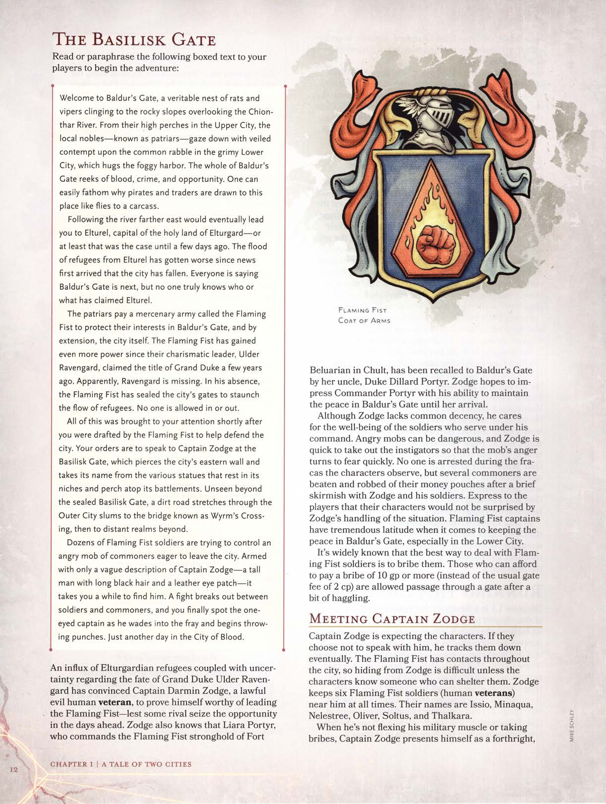
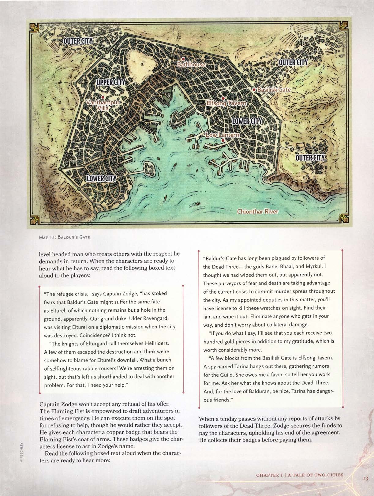

# O Portão do Basilisco

Leia ou parafraseie o seguinte texto em destaque para seus jogadores para iniciar a aventura:

> Bem-vindos a **Baldur's Gate**, um verdadeiro ninho de ratos e víboras agarrado às encostas rochosas que dominam o **Rio Chionthar**. De seus poleiros elevados na **Cidade Alta**, os nobres locais — conhecidos como **patriarcas** — olham com desprezo velado para a plebe imunda na lamacenta **Cidade Baixa**, que abraça o porto nebuloso. Toda **Baldur's Gate** fede a sangue, crime e oportunidade. É fácil entender por que piratas e comerciantes são atraídos para este lugar como moscas para uma carcaça.
>
> Seguindo o rio mais a leste, você acabaria chegando a **Elturel**, capital da terra sagrada de **Elturgard** — ou pelo menos esse era o caso até alguns dias atrás. O fluxo de refugiados de **Elturel** piorou desde que as primeiras notícias chegaram de que a cidade caiu. Todos dizem que **Baldur's Gate** é a próxima, mas ninguém sabe ao certo quem ou o que reivindicou **Elturel**.
>
> Os **patriarcas** pagam um exército mercenário chamado **Punho Flamejante** para proteger seus interesses em **Baldur's Gate** e, por extensão, a própria cidade. O **Punho Flamejante** ganhou ainda mais poder desde que seu líder carismático, **Ulder Ravengard**, assumiu o título de **Grão-Duque** há alguns anos. Aparentemente, **Ravengard** está desaparecido. Em sua ausência, o **Punho Flamejante** selou os portões da cidade para estancar o fluxo de refugiados. Ninguém tem permissão para entrar ou sair.
>
> Tudo isso foi levado à sua atenção logo após vocês serem recrutados pelo **Punho Flamejante** para ajudar a defender a cidade. Suas ordens são falar com o **Capitão Zodge** no **Portão do Basilisco**, que perfura a muralha leste da cidade e leva esse nome devido às várias estátuas que repousam em seus nichos e poleiros sobre suas ameias. Invisível além do selado **Portão do Basilisco**, uma estrada de terra se estende pelas favelas da **Cidade Externa** até a ponte conhecida como **Travessia do Verme**, e então para reinos distantes além.
>
> Dezenas de soldados do **Punho Flamejante** estão tentando controlar uma multidão enfurecida de plebeus ansiosos para deixar a cidade. Armados apenas com uma descrição vaga do **Capitão Zodge** — um homem alto com longos cabelos pretos e um tapa-olho de couro — leva um tempo até que vocês o encontrem. Uma briga irrompe entre soldados e plebeus, e vocês finalmente avistam o capitão de um olho só enquanto ele entra na briga e começa a desferir socos. Apenas mais um dia na Cidade do Sangue.

Um influxo de refugiados de **Elturgard**, somado à incerteza sobre o destino do **Grão-Duque Ulder Ravengard**, convenceu o **Capitão Darmin Zodge** (um veterano humano leal e mau) a provar seu valor para liderar o **Punho Flamejante** — para que nenhum rival aproveite a oportunidade nos dias que virão. **Zodge** também sabe que **Liara Portyr**, que comanda a fortaleza do **Punho Flamejante** de **Forte Beluarian** em **Chult**, foi convocada de volta a **Baldur's Gate** por seu tio, o **Duque Dillard Portyr**. **Zodge** espera impressionar a **Comandante Portyr** com sua habilidade de manter a paz em **Baldur's Gate** até sua chegada.

Embora falte a **Zodge** decência comum, ele se preocupa com o bem-estar dos soldados que servem sob seu comando. Multidões furiosas podem ser perigosas, e **Zodge** é rápido em neutralizar os instigadores para que a raiva da multidão se transforme rapidamente em medo. Ninguém é preso durante a confusão que os personagens observam, mas vários plebeus são espancados e roubados de suas bolsas de moedas após uma breve escaramuça com **Zodge** e seus soldados. Expresse aos jogadores que seus personagens não ficariam surpresos com a forma como **Zodge** lidou com a situação. Os capitães do **Punho Flamejante** têm uma liberdade tremenda quando se trata de manter a paz em **Baldur's Gate**, especialmente na **Cidade Baixa**.

É amplamente conhecido que a melhor maneira de lidar com os soldados do **Punho Flamejante** é suborná-los. Aqueles que podem pagar um suborno de 10 po ou mais (em vez da taxa de portão usual de 2 pc) recebem passagem por um portão após um pouco de negociação.

## Encontro com o Capitão Zodge

O **Capitão Zodge** está esperando os personagens. Se eles escolherem não falar com ele, ele acabará os rastreando. O **Punho Flamejante** tem contatos por toda a cidade, então se esconder de **Zodge** é difícil, a menos que os personagens conheçam alguém que possa lhes dar abrigo. **Zodge** mantém seis soldados do **Punho Flamejante** (**veteranos** humanos) perto dele o tempo todo. Seus nomes são **Jssio**, **Minaqua**, **Nelestree**, **Oliver**, **Soltus** e **Thalkara**.

Quando não está flexionando seu músculo militar ou aceitando subornos, o **Capitão Zodge** se apresenta como um homem direto e sensato que trata os outros com o respeito que exige em troca. Quando os personagens estiverem prontos para ouvir o que ele tem a dizer, leia o seguinte texto em destaque para os jogadores:

> "A crise dos refugiados", diz o **Capitão Zodge**, "alimentou temores de que **Baldur's Gate** possa sofrer o mesmo destino que **Elturel**, da qual nada resta além de um buraco no chão, aparentemente. Nosso grão-duque, **Ulder Ravengard**, estava visitando **Elturel** em uma missão diplomática quando a cidade foi destruída. Coincidência? Acho que não.
>
> "Os cavaleiros de **Elturgard** se autodenominam **Cavaleiros do Inferno** (*Hellriders*). Alguns deles escaparam da destruição e acham que somos de alguma forma culpados pela queda de **Elturel**. Que bando de baderneiros hipócritas! Estamos prendendo-os à vista, mas isso nos deixou com falta de pessoal para lidar com outro problema. Para isso, preciso da ajuda de vocês."

O **Capitão Zodge** não aceitará qualquer recusa de sua oferta. O **Punho Flamejante** tem autoridade para recrutar aventureiros em tempos de emergência. Ele pode executá-los no local por se recusarem a ajudar, embora prefira que aceitem. Ele dá a cada personagem um distintivo de cobre com o brasão do **Punho Flamejante**. Esses distintivos dão aos personagens licença para agir em nome de **Zodge**.

Leia o seguinte texto em destaque quando os personagens estiverem prontos para ouvir mais:

> "**Baldur's Gate** é atormentada há muito tempo pelos seguidores dos **Três Mortos** — os deuses **Bane**, **Bhaal** e **Myrkul**. Eu pensei que os tivéssemos aniquilado, mas aparentemente não. Esses propagadores de medo e morte estão aproveitando a crise atual para cometer assassinatos em série por toda a cidade. Como meus representantes designados para este assunto, vocês terão licença para matar esses miseráveis à vista. Encontrem o covil deles e eliminem-no. Eliminem qualquer um que cruzar seu caminho e não se preocupem com danos colaterais.
>
> "Se vocês fizerem o que eu digo, garantirei que cada um receba duzentas peças de ouro, além da minha gratidão, que vale consideravelmente mais.
>
> "A alguns quarteirões do **Portão do Basilisco** fica a **Taverna Canção do Elfo**. Uma espiã chamada **Tarina** costuma frequentar o local, coletando rumores para a **Guilda**. Ela me deve um favor, então digam a ela que trabalham para mim. Perguntem o que ela sabe sobre os **Três Mortos**. E, pelo amor de **Balduran**, sejam gentis. **Tarina** tem amigos perigosos."

Quando um período de dez dias (**dezenas**) se passa sem relatos de ataques de seguidores dos **Três Mortos**, **Zodge** obtém os fundos para pagar os personagens, cumprindo sua parte no acordo. Ele recolhe os distintivos antes de pagá-los.

## Navegação

- [Anterior: Mal em Baldur's Gate](02-mal-em-baldurs-gate.md)
- [Próximo: Taverna Canção do Elfo](04-taverna-cancao-do-elfo.md)
- [README](../../README.md)
