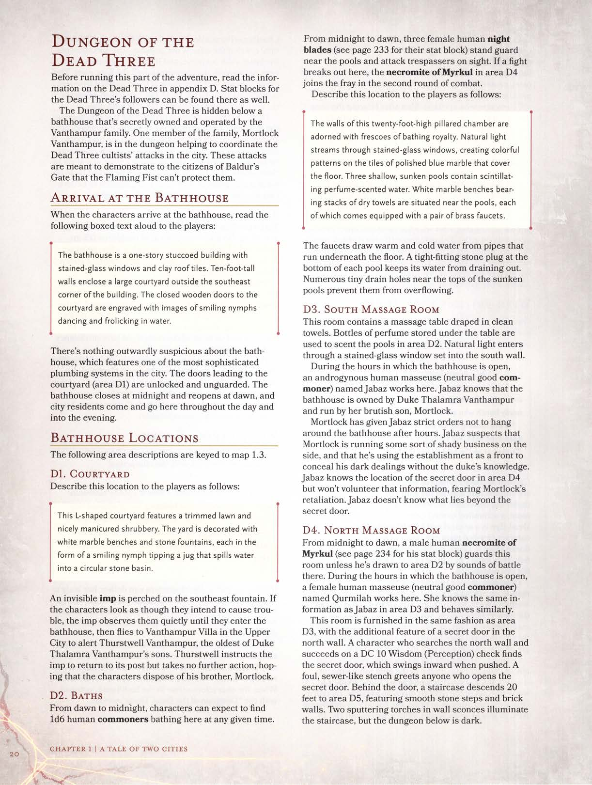

# Calabouço dos Três Mortos

Antes de mestrar esta parte da aventura, leia as informações sobre os **Três Mortos** no apêndice D. Os blocos de estatísticas para os seguidores dos **Três Mortos** também podem ser encontrados lá.

O **Calabouço dos Três Mortos** está escondido sob uma casa de banhos que é secretamente de propriedade e operada pela família **Vanthampur**. Um membro da família, **Mortlock Vanthampur**, está no calabouço ajudando a coordenar os ataques dos cultistas dos **Três Mortos** na cidade. Esses ataques visam demonstrar aos cidadãos de **Baldur's Gate** que o **Punho Flamejante** não pode protegê-los.

## Chegada à Casa de Banhos

Quando os personagens chegarem à casa de banhos, leia o seguinte texto em voz alta para os jogadores:

> A casa de banhos é um edifício de estuque de um andar com janelas de vitral e telhas de barro. Muros de três metros de altura cercam um grande pátio do lado de fora do canto sudeste do edifício. As portas de madeira fechadas para o pátio estão gravadas com imagens de ninfas sorridentes dançando e brincando na água.

Não há nada exteriormente suspeito sobre a casa de banhos, que apresenta um dos sistemas de encanamento mais sofisticados da cidade. As portas que levam ao pátio (**D1**) estão destrancadas e sem guarda. A casa de banhos fecha à meia-noite e reabre ao amanhecer, e os residentes da cidade entram e saem daqui ao longo do dia e até a noite.

## Localizações da Casa de Banhos

As descrições das áreas a seguir estão vinculadas ao **Mapa 1.3: Calabouço dos Três Mortos**.

### D1. Pátio
Descreva esta localização para os jogadores da seguinte forma:

> Este pátio em forma de L apresenta um gramado aparado e arbustos bem cuidados. O quintal é decorado com bancos de mármore branco e fontes de pedra, cada uma na forma de uma ninfa sorridente inclinando um jarro que derrama água em uma bacia de pedra circular.

Um **imp** invisível está empoleirado na fonte sudeste. Se os personagens parecerem que pretendem causar problemas, o imp os observa silenciosamente até que entrem na casa de banhos, então voa para a **Vila Vanthampur** na **Cidade Alta** para alertar **Thurstwell Vanthampur**, o mais velho dos filhos da **Duquesa Thalamra Vanthampur**. Thurstwell instrui o imp a retornar ao seu posto, mas não toma nenhuma outra ação, esperando que os personagens se livrem de seu irmão, **Mortlock**.

### D2. Banhos
Do amanhecer à meia-noite, os personagens podem esperar encontrar 1d6 **plebeus** humanos banhando-se aqui a qualquer momento.
Da meia-noite ao amanhecer, três **lâminas da noite** (humanas fêmeas) ficam de guarda perto das piscinas e atacam invasores à vista. Se uma luta começar aqui, o **necromita de Myrkul** na área **D4** se junta à batalha na segunda rodada de combate.

Descreva esta localização para os jogadores da seguinte forma:

> As paredes desta câmara de seis metros de altura com pilares são adornadas com afrescos de realeza banhando-se. A luz natural entra pelas janelas de vitrais, criando padrões coloridos nos azulejos de mármore azul polido que cobrem o chão. Três piscinas rasas e afundadas contêm água perfumada e cintilante. Bancos de mármore branco com pilhas de toalhas secas estão situados perto das piscinas, cada uma equipada com um par de torneiras de latão.

As torneiras extraem água quente e fria de canos que correm sob o piso. Uma tampa de pedra bem ajustada no fundo de cada piscina impede que a água escoe. Numerosos pequenos orifícios de drenagem perto do topo das piscinas afundadas evitam que transbordem.

### D3. Sala de Massagem Sul
Esta sala contém uma mesa de massagem coberta com toalhas limpas. Frascos de perfume guardados sob a mesa são usados para perfumar as piscinas na área **D2**. A luz natural entra por uma janela de vitral situada na parede sul.
Durante as horas em que a casa de banhos está aberta, uma massagista humana andrógina (plebeu neutro e bom) chamada **Jabaz** trabalha aqui. Jabaz sabe que a casa de banhos pertence à **Duquesa Thalamra Vanthampur** e é administrada por seu filho brutal, **Mortlock**.
**Mortlock** deu ordens estritas a Jabaz para não ficar na casa de banhos após o expediente. Jabaz suspeita que Mortlock está administrando algum tipo de negócio obscuro por fora e que está usando o estabelecimento como fachada para ocultar seus negócios sombrios sem o conhecimento da duquesa. Jabaz conhece a localização da porta secreta na área **D4**, mas não oferecerá essa informação voluntariamente, temendo a retaliação de Mortlock. Jabaz não sabe o que há além da porta secreta.

### D4. Sala de Massagem Norte
Da meia-noite ao amanhecer, um **necromita de Myrkul** (humano macho) guarda esta sala, a menos que seja atraído para a área **D2** por sons de batalha. Durante as horas em que a casa de banhos está aberta, uma massagista humana (plebeia neutra e boa) chamada **Qurmilab** trabalha aqui. Ela conhece as mesmas informações que Jabaz na área **D3** e se comporta de forma semelhante.
Esta sala é mobiliada da mesma forma que a área **D3**, com a característica adicional de uma **porta secreta** na parede norte. Um personagem que procure na parede norte e obtenha sucesso em um **Teste de Sabedoria (Percepção) CD 10** encontra a porta secreta, que abre para dentro quando empurrada. Um fedor fétido, semelhante ao de um esgoto, saúda qualquer um que abra a porta secreta. Atrás da porta, uma escadaria desce 6 metros até a área **D5**, apresentando degraus de pedra lisa e paredes de tijolos. Duas tochas crepitantes em arandelas de parede iluminam a escadaria, mas o calabouço abaixo está escuro.

## O Calabouço (Dungeon)

A **Duquesa Vanthampur** tomou conhecimento deste antigo calabouço enquanto gerenciava os serviços de água e o sistema de esgoto da cidade. Ela construiu a casa de banhos para escondê-lo.
A câmara no fundo da escadaria está vazia, sem iluminação e inundada com água fétida a uma profundidade de 60 centímetros.

### Características do Calabouço
O **Calabouço dos Três Mortos** possui as seguintes características recorrentes:
* **Iluminação:** As salas, corredores e escadarias são esculpidos em calcário e não possuem iluminação, a menos que o texto diga o contrário. (Seguidores dos Três Mortos carregam tochas ou dependem de visão no escuro).
* **Corredores e Tetos:** Os corredores de 1,5 metro de largura têm tetos de 2,4 metros de altura. As salas têm tetos de 2,7 metros, muitas vezes reforçados com vigas de madeira. Cada viga é um objeto Grande com CA 15, 10 pontos de vida e imunidade a veneno e dano psíquico. Destruir todas as vigas em uma área tem 25% de chance de desencadear um desabamento. Cada criatura sob o teto que desaba deve ser bem-sucedida em um **Teste de Resistência de Destreza CD 15**, sofrendo 22 (4d10) de dano de concussão em uma falha, ou metade desse dano em um sucesso. A área permanece aberta, mas torna-se terreno difícil.
* **Portas:** Portas comuns são feitas de madeira macia e podre (CA 15, 5 PV, imunidade a veneno/psíquico). Portas secretas são esculpidas para parecerem com as paredes de calcário e exigem um **Teste de Sabedoria (Percepção) CD 10** para serem localizadas.
* **Inundação:** Certas áreas estão inundadas com água turva a uma profundidade de 60 cm, tornando-as terreno difícil. A água cheira mal e não é potável.

### D6. Cadáver Inchado
Flutuando de bruços no meio desta sala inundada está o cadáver inchado de um homem humano sem camisa com ferimentos de faca nas costas. O cadáver foi um adorador de **Bhaal** chamado **Hiskaal**, morto por seus pares cultistas por permitir que um alvo escapasse. Um **Teste de Sabedoria (Medicina) CD 10** conclui que ele está morto há dois dias.

### D7. Altar de Bhaal
Descreva esta localização para os jogadores da seguinte forma:

> Três vigas de madeira sustentam o teto desta câmara inundada, que apresenta um altar de pedra coberto com entranhas no canto nordeste. Pendurada na parede acima do altar está uma máscara de aço de um metro de altura fundida na forma de um crânio humano franzido.

A máscara de crânio de aço representa o semblante de **Bhaal** e não possui propriedades mágicas. As entranhas humanoides foram deixadas no altar como uma oferenda ao deus do assassinato. Derramar um frasco de água benta nas entranhas faz com que elas derretam e o altar comece a fumegar.

### D8. Tapeçaria Mofada
A parede traseira deste nicho seco está pendurada com uma tapeçaria de 1,5 por 2,1 metros. Ela retrata uma cena macabra de quatro figuras sem rosto rasgando uma quinta figura, que está gritando. Personagens que inspecionarem a tapeçaria sem tocá-la notam **mofo amarelo** crescendo em suas bordas. Se perturbada, o mofo libera esporos mortais (veja o *Guia do Mestre*).

### D9. As Portas dos Três Mortos
Esta câmara está vazia, mas não desprovida de decoração. Esculpida em cada uma de suas três portas está uma representação de corpo inteiro de um dos **Três Mortos**. Um personagem reconhece as figuras com um **Teste de Inteligência (Religião) CD 10**.
* **Porta Leste:** Bane, o deus leal e mau da tirania, retratado como um homem alto e blindado usando um elmo de balde. Sua manopla direita é pintada de preto e segura um par de grilhões.
* **Porta Norte:** Bhaal, o deus caótico e mau do assassinato. Retratado como um homem de constituição poderosa com cabeça de caveira e longas lâminas curvas no lugar das mãos.
* **Porta Sul:** Myrkul, o Lorde dos Ossos neutro e mau. Retratado como uma figura encapuzada cujo rosto está escondido. Em suas mãos esqueléticas, ele segura um crânio humano gritando.

### D10. Sala dos Necromitas
As criaturas aqui vigiam a área **D9** através de uma fresta na porta.

> Caídos no chão desta sala, de outra forma vazia, estão os corpos pálidos de três humanos em vestes pretas imundas, dispostos em uma formação triangular. Uma tocha acesa jaz entre eles. Uma escadaria rudimentar à esquerda leva para baixo, para outra câmara iluminada por tochas.

Estes três **necromitas de Myrkul** estão fingindo-se de mortos. Eles escondem seus mangual-caveira sob as vestes. Eles atacam se alguém entrar ou se forem atacados. Eles lutam até a morte para guardar o tesouro na área **D11**.

### D11. Cripta Parcialmente Desabada
Esta câmara desabou parcialmente em torno de um sarcófago de pedra que foi aberto e saqueado há muito tempo.
**Tesouro:** Os necromitas esconderam três **livros de feitiços** sob a poeira e ossos no sarcófago.
1. Encadernado em couro vermelho: *mãos flamejantes, detectar magia, disfarçar-se, névoa oscilante, raio de adoecimento, imagem silenciosa*.
2. Com a runa pessoal do dono anterior: *enfeitiçar pessoa, encontrar familiar, identificar, mísseis mágicos, sono*.
3. Encadernado em pele de réptil preta: *nuvem de adagas, visão no escuro, detectar magia, queda suave, armadura arcana, mísseis mágicos, riso horrível de Tasha*.

### D12. Altar de Bane
Descreva esta área aos jogadores:

> A parte leste desta sala está sem iluminação, inundada e reforçada com vigas de madeira do chão ao teto. Degraus rudimentares emergem da água turva para a porção oeste da sala, que está seca e iluminada por duas tochas em arandelas que ladeiam um altar de pedra. Acorrentado à parede atrás do altar está um homem doentio em uma tanga com um saco de estopa na cabeça. Um nicho na parede norte contém uma armadura de placas completa, sem o elmo.
> Diante do altar estão duas figuras sombrias: uma mulher de constituição poderosa segurando uma maça e um homem ainda maior usando um elmo de balde. O homem está cutucando o prisioneiro com uma lança. Ambos usam cota de malha.

As figuras são **Kazzira** (fêmea, **punho de Bane**) e **Yignath** (macho, **cônsul de Ferro**). Yignath tortura o prisioneiro por diversão. Yignath carrega as chaves para os grilhões e para os baús na área **D30**.
O prisioneiro é **Klim Jhasso**, um nobre humano capturado na **Cidade Baixa**. Ele é um nobre neutro e mau com 1 PV. Ele mente sobre uma recompensa generosa; sua família está em dificuldades financeiras.
**Manoplas Animadas:** As manoplas da armadura de placas são objetos animados (estatísticas de **espadas voadoras**, mas dano de concussão) que atacam se o prisioneiro for libertado ou a armadura perturbada.

### D13. Necrotério
A necromante sobre o cadáver é **Flennis**, uma **mestra das almas** (humana fêmea) e a seguidora de **Myrkul** de mais alto escalão no calabouço. Ela é acompanhada por um **enxame de ratos esqueléticos** (use as estatísticas de enxame de ratos, mas são mortos-vivos).
Flennis está preparando um zumbi. Em combate, ela usa feitiços enquanto os ratos atacam.
**Tesouro:** Ela carrega um livro de feitiços com um fecho em forma de caveira. A primeira pessoa (além de Flennis) a abrir o livro deve ser bem-sucedida em um **Teste de Resistência de Constituição CD 14** ou será amaldiçoada com vulnerabilidade a dano necrótico por 24 horas.

### D14. Rato Faminto
Um rato comum corre por aqui. Se os personagens falarem com ele (*falar com animais*), ele pode compartilhar conhecimentos sobre as áreas **D5** a **D26**. Ele não conhece as portas secretas.

### D15. Sala Inundada
Túneis estreitos e inundados. Nada de interesse no entulho.

### D16. Cripta Inundada
Um sarcófago de pedra com a tampa quebrada. A tampa retrata um bárbaro gritando.
**Armadilha:** Se o sarcófago for perturbado, um **machado de batalha fantasmagórico** aparece (efeito de *arma espiritual* de 2º nível, +5 para atingir, 1d8+2 de dano de força).

### D17. Altar de Myrkul
Um altar de pedra com crânios e ossos humanos, coberto por velas pretas apagadas. Se acesas, as velas emitem uma luz verde que revela a escrita nas paredes: "RISE AND BE COUNTED!" (Levantem-se e sejam contados!). Se ditas em voz alta perto do altar, as palavras animam **três esqueletos** que obedecem a quem as pronunciou.

### D18. Acúmulo de Gás
O ar cheira a ovos podres (gás inflamável). Tochas ou chamas abertas causam uma explosão: 14 (4d6) de dano de fogo (**TR Destreza CD 15** para metade). Criaturas submersas na água não sofrem dano. A explosão pode destruir as vigas e causar desabamento.

### D19. Cripta Parcialmente Desabada
Nada de interesse.

### D20. Cripta Semisaqueada
O sarcófago tem um fundo falso de gesso. Abaixo, há uma múmia humana (inanimada) flutuando em salmoura vermelha, com duas **pedras da lua** (50 po cada) nos olhos e um **saco de feijões mágicos** onde ficaria o coração.

### D21. Cripta dos Zumbis
Contém seis **zumbis** criados por Flennis. Eles atacam qualquer um que não seja sua criadora.

### D22. Câmara de Tortura
Seguidores de Bane torturam prisioneiros aqui.
* **Effinax Zalbor:** Humano, morto.
* **Vendetta Kress:** Tiefling, inconsciente (0 PV) mas estável. Ela é uma plebeia neutra. Se salva, ela menciona ter ouvido o som de uma porta de pedra pesada se abrindo ao norte (área **D23**).

### D23. Porta Secreta e Sentinela
Um **punho de Bane** vigia esta área. Se vir intrusos, ele corre para a área **D25** gritando para alertar os outros.

### D24. Descanso de Myrkul
Seis sacos de dormir ao redor de um sarcófago cheio de ossos. Usado pelos Myrkulitas para descansar.

### D25. Descanso de Bane
Quatro **punhos de Bane** dormindo aqui. Eles se mobilizam rapidamente se alertados.

### D26. Descanso de Bhaal
Um sarcófago cheio de sangue humano. Uma **ceifadora de Bhaal** chamada **Nebra** se esconde aqui. Ela usa *disfarçar-se* para parecer uma velha florista escravizada, tentando levar os personagens para uma emboscada na área **D29**.

### D27. Ecos de Batalha
Corredor inundado onde se ouvem sons de luta vindos da área **D29**.

### D28. Antiga Adega
Quatro **esqueletos** animados escondidos sob a água atacam quem atravessar a sala.

### D29. Mortlock Vanthampur
Nesta câmara, dois homens estão lutando:
1. **Mortlock Vanthampur:** Um bruto de 2 metros de altura, desfigurado por cicatrizes, usando uma clava grande. Ele está gravemente ferido (30 PV restantes).
2. **Vaaz:** Uma **cabeça da morte de Bhaal** (musculoso, sem pele no crânio, empunhando adaga e tocha).

Vaaz recua para a área **D33** se os personagens interferirem. **Mortlock** tentará formar uma aliança, revelando:
* Ele foi traído por seus irmãos, **Thurstwell** e **Amrik**.
* Sua família paga os cultistas para desestabilizar a cidade e o **Punho Flamejante**.
* Sua mãe, **Duquesa Thalamra Vanthampur**, quer se tornar a próxima **Grão-Duquesa** e levar **Baldur's Gate** para os **Nove Infernos**, como **Elturel**.
* **Amrik Vanthampur** opera na taverna **Lanterna Baixa** (*Low Lantern*).
* **Thurstwell Vanthampur** usa imps como espiões.

### D30. Tesouro Roubado de Tiamat
Quatro baús de madeira com cadeados. As chaves estão com o Cônsul de Ferro na área **D12**. O conteúdo foi roubado do tesouro de **Tiamat** em **Avernus**.
* **Baú 1:** 4.500 pc e duas poções de *sopro de fogo*.
* **Baú 2:** 1.250 pp e dez ágatas oculares (10 po cada).
* **Baú 3:** 2.400 pc, 500 pp e uma máscara de dragão de porcelana (25 po).
* **Baú 4:** Uma coroa de bronze com cinco agulhas representando os cinco dragões cromáticos (250 po).

### D31. Tochas
Caixa com cinco tochas restantes.

### D32. Mercadorias Roubadas
Nove caixotes. Contêm rações, abrolhos, fogo alquímico, algemas, isqueiros, adagas e quatro **poções de cura**.

### D33. Pacto dos Três Mortos
Três estátuas de madeira de 1,8 metro representando os **Três Mortos**:
* **Bane:** Homem de armadura com manopla preta e lança vermelha. Quem chegar perto deve ser bem-sucedido em um **TR de Carisma CD 12** ou será compelido a se ajoelhar.
* **Bhaal:** Nobre com máscara de arlequim (removível, revelando um crânio).
* **Myrkul:** Esqueleto de vestes pretas. Quem profanar a estátua é amaldiçoado e não recebe benefícios de cura mágica.

---

## Encontro Final: Cultistas do Dragão
Ao sair da casa de banhos, os personagens são confrontados no pátio (**D1**) por cinco **cultistas do dragão** (usando máscaras e mantos escamosos) que buscam recuperar o tesouro de **Tiamat**.

---

## Navegação
- [Página Anterior: Taverna Elfsong](../01-conto-de-duas-cidades/04-taverna-elfsong.md)
- [Próxima Página: Lanterna Baixa](../01-conto-de-duas-cidades/06-lanterna-baixa.md)
- [Índice da Campanha](../../README.md)
