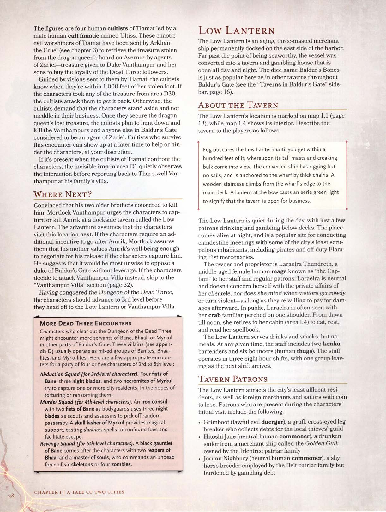

# A Lanterna Baixa (Low Lantern)

A **Lanterna Baixa** é um antigo navio mercante de três mastros permanentemente ancorado no lado leste do porto. Muito além do ponto de ser navegável, a embarcação foi convertida em uma taverna e casa de apostas que fica aberta dia e noite. O jogo de dados **Ossos de Baldur** é tão popular aqui quanto em outras tavernas de **Baldur's Gate**.

## Sobre a Taverna

A localização da **Lanterna Baixa** está marcada no mapa da cidade. A névoa obscurece o navio até que você esteja a trinta metros dele, momento em que seus mastros altos e casco rangente entram em vista. O navio convertido possui cordame, mas não velas, e está ancorado ao cais por correntes grossas. Uma escada de madeira sobe da borda do cais até o convés principal. Uma lanterna na proa emite uma luz verde fantasmagórica para sinalizar que a taverna está aberta.

A taverna é silenciosa durante o dia, com apenas alguns clientes bebendo e jogando nos conveses inferiores. O lugar ganha vida à noite, sendo um local popular para reuniões clandestinas com alguns dos habitantes menos escrupulosos da cidade, incluindo piratas e mercenários do **Punho Flamejante** fora de serviço.

A proprietária é **Laraelra Thundreth**, uma maga humana de meia-idade conhecida como "a Capitã" por sua equipe e clientes regulares. Laraelra é neutra e não se preocupa com os assuntos privados de sua clientela, nem se importa quando os visitantes ficam barulhentos ou violentos — desde que estejam dispostos a pagar pelos danos depois. Em público, Laraelra é frequentemente vista com seu familiar caranguejo empoleirado em um ombro. Do amanhecer ao meio-dia, ela se retira para sua cabine (área L4) para comer, descansar e ler seu livro de magias.

A equipe inclui dois bartenders **kenku** e seis seguranças (**brutos** humanos).

## Frequentadores da Taverna

A **Lanterna Baixa** atrai os residentes menos abastados da cidade, bem como mercadores estrangeiros e marinheiros. Patrons notáveis incluem:

*   **Grimboot** (**duergar** leal e mau), um cobrador de dívidas rabugento e estrábico que trabalha para a guilda de ladrões local.
*   **Hitoshijade** (humano comum neutro), um marinheiro bêbado do navio mercante *Gaivota Dourada*.
*   **Jorunn Nighbury** (humano comum neutro), um criador de cavalos tímido sobrecarregado por dívidas de jogo.
*   **Skadric Salakar** (humano veterano neutro e mau), um soldado preguiçoso do **Punho Flamejante** suspenso sem pagamento.
*   **Prynn Derringwhistle** (**halfling Coração-Forte** comum leal e neutra), uma limpadora de cracas que gosta de cantar antigas canções de marinheiro.
*   **Aerith** e **Beldan** (**drow** caóticos e bons), gêmeos desajeitados e inseparáveis que deixaram o **Subterrâneo** em busca de aventura.

**Amrik Vanthampur** opera seu próprio negócio na **Lanterna Baixa** com o consentimento de Laraelra. Personagens que o procuram são direcionados para a área L6.

---

## Localizações da Taverna

### L1. Convés Principal
O convés principal apresenta degraus de madeira que sobem para o castelo de proa e o de popa, e outro conjunto de escadas que descende para o interior do navio. Uma escotilha de madeira trancada com cadeado e equipada com janelas atua como claraboia para o convés inferior. Duas **corujas** (na verdade, **imps** transformados) observam do cesto da gávea, a doze metros de altura. Eles vigiam Amrik para seu irmão, **Thurstwell Vanthampur**.

### L2. Castelo de Proa
Este convés costuma ter carcaças de gaivotas mortas (picadas pelos imps). A lanterna de vidro verde pendurada na proa indica que a taverna está aberta. Em noites quentes e claras, mesas e cadeiras são colocadas aqui para os clientes.

### L3. Castelo de Popa
A roda do capitão e o leme se foram. Como na proa, mesas são colocadas aqui em noites de tempo bom.

### L4. Cabine de Laraelra
A cabine está destrancada, mas vigiada por um segurança na área L5. Contém móveis de madeira descombinados e um baú marinho esculpido e trancado (CD 20 para abrir).
*   **Armadilha:** O baú contém quatro **adagas voadoras** que atacam qualquer um que não seja Laraelra ao abri-lo.
*   **Tesouro:** O baú contém botas, vinho fino, cartas de um admirador e o **livro de magias de Laraelra**.

### L5. Salão de Bebidas e Jogos
Esta é a parte mais movimentada e barulhenta do navio, cheirando a suor, cerveja barata e madeira podre. Três seguranças vigiam o local. Laraelra geralmente é encontrada aqui se não estiver em sua cabine.

### L6. Lounge da Taverna
Este convés iluminado por lanternas de óleo contém um bar, sofás e mesas de jogo. **Amrik Vanthampur** transformou um par de sofás e uma mesa de centro em seu escritório pessoal. Ele dirige um negócio de empréstimo de dinheiro aqui.
Amrik é acompanhado por dois guarda-costas: **Kasharra**, um **diabo espinhoso**, e **Vhaltus**, um humano bruto. Amrik possui uma **bomba de fumaça** para fugir se necessário e pode sinalizar ao bartender para envenenar as bebidas de seus clientes com **entorpecente** (*torpor*).

### L7. Cabine de Hóspedes
Uma cabine atualmente desocupada. A fechadura está enferrujada, mas a porta pode ser calçada com uma cadeira.

### L8. Alojamentos
Localizado no nível submerso, este local fede a vômito e urina. Contém beliches e redes baratas onde bêbados dormem para curar a ressaca.

---

## Lidando com Amrik

Amrik assume que os personagens vieram pedir um empréstimo (até 150 po). Seus termos são 25% de juros em dez dias. Como membro da influente família **Vanthampur**, ele tem muitos capangas para cobrar dívidas.

Os personagens podem tentar interrogá-lo, mas ele é um mentiroso treinado. Ele desdenha seu irmão **Mortlock** e tentará transferir qualquer culpa para ele. Se pressionado, ele usará o nome e a reputação de sua mãe, a **Duquesa Thalamra Vanthampur**, como escudo.
Amrik nunca luta até a morte e se renderá se não puder fugir ou conversar. Se morto, Laraelra avisa que a fúria da Duquesa cairá sobre os personagens e sugere que eles fujam de **Baldur's Gate**.

## Reya Mantlemorn

Antes dos personagens deixarem a **Lanterna Baixa**, uma nova figura os aborda: uma jovem de pele bronzeada, cabelos vermelhos e olhar assombrado, vestindo armadura e uma capa com capuz.

Esta é **Reya Mantlemorn**, uma **Hellrider** (veterana) leal e boa de **Elturel**. Fiel seguidora de **Torm**, ela treinou para se sacrificar pelo bem maior e está em busca de respostas sobre o destino de sua cidade.

---

## Navegação
- [Voltar para: Masmorra dos Três Mortos](../01-conto-de-duas-cidades/05-masmorra-dos-tres-mortos.md)
- [Avançar para: Vila Vanthampur](../01-conto-de-duas-cidades/07-vila-vanthampur.md)
- [Menu Principal](../../README.md)
