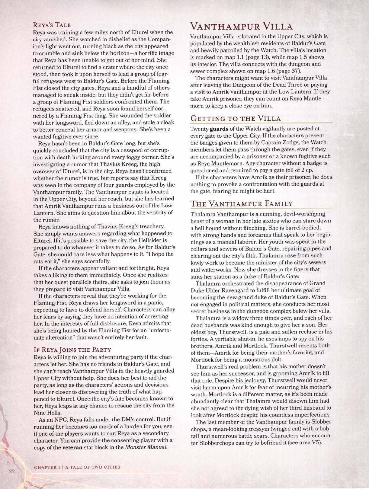

# Vila Vanthampur

A **Vila Vanthampur** está localizada na **Cidade Alta**, habitada pelos residentes mais ricos de **Portal de Baldur** e pesadamente patrulhada pela **Vigilância**. A localização da vila está marcada no mapa 1.1 (página 13), enquanto o mapa 1.5 mostra seu interior. A vila se conecta com o complexo de masmorras e esgotos mostrado no mapa 1.6 (página 37).

Os personagens podem querer visitar a **Vila Vanthampur** após deixarem a **Masmorra dos Três Mortos** ou após visitarem **Amrik Vanthampur** no **Lanterna Baixa**. Se eles fizerem de **Amrik** seu prisioneiro, podem contar com **Reya Mantlemorn** para ficar de olho nele.

## Chegando à Vila

Vinte guardas da **Vigilância** estão postados vigilantemente em cada portão da **Cidade Alta**. Se os personagens apresentarem os distintivos dados a eles pelo **Capitão Zodge**, os membros da **Vigilância** os deixarão passar pelos portões, mesmo que estejam acompanhados por um prisioneiro ou uma fugitiva conhecida como **Reya Mantlemorn**. Qualquer personagem sem um distintivo é interrogado e obrigado a pagar um pedágio de portão de 2 pc.

## A Família Vanthampur

**Thalamra Vanthampur** é uma mulher astuta de quase setenta anos, adoradora de diabos, que pode encarar um **cão infernal** sem piscar. Ela tem um corpo robusto, com mãos e antebraços fortes que remetem aos seus começos como trabalhadora braçal. Sua juventude foi passada nos porões e esgotos de **Portal de Baldur**, consertando canos e limpando a sujeira da cidade. **Thalamra** ascendeu desse trabalho humilde para se tornar a ministra dos esgotos e obras hidráulicas da cidade. Agora, ela se veste com as finas roupas que convêm à sua posição como **Duquesa de Portal de Baldur**.

**Thalamra** orquestrou o desaparecimento do **Grão-Duque Ulder Ravengard** para cumprir seu objetivo final de se tornar a nova **Grão-Duquesa de Portal de Baldur**. Quando não está envolvida em assuntos políticos, ela conduz seus negócios mais secretos no complexo de masmorras abaixo de sua vila.

**Thalamra** é viúva por três vezes, e cada um de seus maridos falecidos teve a bondade de lhe dar um filho. Seu filho mais velho, **Thurstwell**, é um recluso pálido e ranzinza na casa dos quarenta anos. Um verdadeiro ermitão, ele usa **imps** para espionar seus irmãos, **Amrik** e **Mortlock**. **Thurstwell** se ressente de ambos — de **Amrik** por ser o favorito de sua mãe, e de **Mortlock** por ser um idiota monstruoso.

O verdadeiro problema de **Thurstwell** é que sua mãe não o vê como seu sucessor, e está preparando **Amrik** para preencher esse papel. Apesar de seu ciúme, **Thurstwell** nunca faria mal a **Amrik** por medo de incorrer na ira de sua mãe. **Mortlock** é uma questão diferente, pois ficou abundantemente claro que **Thalamra** o teria deserdado se não tivesse concordado com o desejo de morte de seu terceiro marido de cuidar de **Mortlock**, apesar de suas inúmeras imperfeições.

O último membro da família **Vanthampur** é **Slobberchops**, um **tressym** (gato alado) de aparência malvada, com cauda curta e inúmeras cicatrizes de batalha. Personagens que encontrarem **Slobberchops** podem tentar fazer amizade com ele (veja a área V5).

## Sobre a Vila

A **Vila Vanthampur** é uma imponente edificação de pedra com uma estrebaria separada. Ambos os edifícios possuem telhados inclinados cobertos com telhas de argila vermelha. Um muro de pedra de 3,6 metros de altura envolve a vila. Lanternas penduradas ao longo do interior do muro são acesas ao entardecer e apagadas ao amanhecer para iluminar o pátio e a vila à noite. O muro possui três portões de madeira — a entrada principal e um portão de carruagem ao sul, e um portão lateral ao norte.

As portas de madeira e as janelas com moldura de chumbo da vila não estão trancadas, e os **Vanthampur** empregam guardas para patrulhar o pátio (veja a área V1). Os guardas vivem em outro lugar e trocam de turno a cada seis horas.

### Servos

Os **Vanthampur** empregam quatro servos que moram no local em tempo integral:
*   **Fendrick Gray**, um mordomo decrépito de setenta anos.
*   **Sarvinder Peck**, um capataz e mestre de estábulos ríspido de cinquenta e dois anos.
*   **Gabourey D'Vaelan**, uma cozinheira exigente de trinta e cinco anos.
*   **Ambra Fallwater**, uma empregada franca de dezenove anos.

**Ambra** foi contratada recentemente para substituir a empregada anterior, a quem a **Duquesa Vanthampur** jogou escada abaixo por quebrar um vaso.

## Localizações da Vila

As descrições das áreas a seguir referem-se ao **Mapa 1.5**.

### V1. Pátio
Nove guardas humanos leais e maus patrulham o pátio em três grupos de três. Eles atacam qualquer um que invadir a propriedade sem o consentimento da **Duquesa Vanthampur** ou de um de seus filhos. Se os personagens estiverem com **Amrik** ou **Mortlock**, podem convencê-los a passar pelos guardas. Caso contrário, precisam eliminá-los ou passar furtivamente (**Teste de Destreza [Furtividade] CD 13**, com vantagem à noite ou na névoa).

### V2. Estrebaria
Este edifício de pedra contém estábulos para quatro cavalos de tração e uma ferraria completa. **Sarvinder Peck** pode ser encontrado aqui.
*   **Alçapão:** Um ladrilho de 90 cm no canto sudoeste esconde um alçapão (**Teste de Sabedoria [Percepção] CD 15** para encontrar). Ele leva a uma escada que desce 4,5 metros até a área **V27** da masmorra.

### V3. Átrio
O mordomo **Fendrick Gray** recebe os visitantes aqui.
*   **Imps:** Quatro **imps** invisíveis espreitam em uma prateleira alta a 2,7 metros de altura. Eles atacam intrusos.
*   **Tesouro:** Vasos ornamentais (25 po cada), um tapete requintado de coroação (250 po) e duas tapeçarias (75 po cada).

### V4. Aposentos dos Servos
Quarto simples com quatro camas e uma mesa de jantar. Nada de valor.

### V5. Cozinha
A cozinheira **Gabourey D'Vaelan** prepara as refeições aqui. Um monta-cargas manual leva comida para o quarto da duquesa (**V17**).
*   **Slobberchops:** O **tressym** caça ratos aqui. Ele detesta **Thurstwell** e seus **imps**. Se alimentado, ele pode se tornar amigável e usar sua característica de **Detectar Invisibilidade** para alertar sobre **imps** próximos.

### V6. Despensa
Armazenamento de comida e bebida.

### V7. Escada para Baixo
Contém um barril de água fresca e uma escada que desce 4,5 metros até a área **V20**.

### V8. Sala de Estar
Usada para receber visitas. A cadeira da duquesa possui um compartimento secreto no braço esquerdo contendo uma **adaga prateada** (**Teste de Sabedoria [Percepção] CD 12**).
*   **Tesouro:** Uma tapeçaria na parede norte retrata anjos queimando caindo em um fosso de fogo (150 po).

### V9. Sala de Jantar
Mesa de carvalho preto com oito cadeiras esculpidas como diabos.
*   **Imps:** Três **imps** invisíveis no lustre atacam intrusos.
*   **Tesouro:** Oito cálices de cristal vermelho (25 po cada) e dezesseis garrafas de vinho. Uma das garrafas está envenenada com **lágrimas da meia-noite** (destinada a convidados indesejados).

### V10. Galeria
Contém tapeçarias, pinturas e bustos de alabastro. A maioria são falsificações de mau gosto.
*   **Estátua de Cera:** Uma estátua de cera de 1,8 metro de **Thalamra Vanthampur** segurando **Slobberchops**.

### V11. Corredor Superior
Cinco guardas vigiam este corredor (um em cada porta). Eles atacam qualquer um que não esteja acompanhado por um **Vanthampur**. O combate aqui alerta **Thurstwell** na área **V13**.

### V12. Sacada
Parapeito de pedra com vista para o pátio frontal.

### V13. Quarto de Thurstwell
**Thurstwell Vanthampur** está aqui, segurando uma **Caixa de Enigmas Infernal**. Ele é frágil e maligno. Um **imp** invisível espreita na lareira.
Se interrogado, ele revela:
*   Sua mãe está na masmorra com **Thavius Kreeg**, planejando assumir o controle de **Portal de Baldur**.
*   Eles roubaram o **Escudo do Senhor Oculto**, que contém o diabo **Gargauth**.
*   **Thavius** trouxe a **Caixa de Enigmas**, e **Thurstwell** está tentando abri-la.

*   **Tesouro:** A **Caixa de Enigmas Infernal** (contém o contrato de **Thavius** com **Zariel**). Um baú de ferro trancado (**Teste de Destreza [Ferramentas de Ladrão] CD 15**) contém 73 po, 120 pe, uma **poção de cura** e o livro *Apocalypto* (50 po).

### V14. Quarto de Mortlock
Simples, com roupas grandes e um boneco de troll de pelúcia da infância de **Mortlock**.

### V15. Quarto de Amrik
Bem decorado, com um espelho cujas molduras mostram ratos, corvos e aranhas.
*   **Tesouro:** No baú, há um anel de sinete de ouro (5 po) com o lema dos **Vanthampur**: *"Corações de pedra nunca sangram"*.

### V16. Lavabo da Duquesa
Perfumes, cosméticos e roupas finas.
*   **Tesouro:** Seis frascos de perfume (20 po cada), escova de cabelo de prata com lápis-lazúli (100 po), colar de pérolas (250 po) e duas **poções de cura**.

### V17. Quarto Principal
Onde a **Duquesa Vanthampur** descansa e faz refeições.
*   **Armadilha de Gás Venenoso:** O baú de ferro aos pés da cama está trancado (**CD 17**) e possui um fundo falso com molas. Se 3 ou mais itens forem removidos, libera uma nuvem de gás venenoso (esfera de 3 metros, 1 minuto, **Salvaguarda de Constituição CD 13** ou 11 [2d10] de dano de veneno).
*   **Tesouro:** Três livros-caixa em **Infernal**, suprimentos de caligrafia (15 po), kit de envenenador (50 po), 22 pp, 85 po, 113 sp e uma **flauta dos esgotos** (*pipes of the sewers*).

### V18. Escritório da Duquesa
Escrivaninha de carvalho e três estantes de livros. Uma armadura de placas preta fica aqui.
*   **Terror Elmo (*Helmed Horror*):** A armadura é um construto de **Avernus** que ataca qualquer um não acompanhado por um **Vanthampur**. É imune a *ferrolho de fogo*, *chama sagrada* e *toque chocante*.
*   **Tesouro:** Vinte edições raras (25 po cada). Um compartimento secreto no livro *"Last Charge of the Hellriders"* contém duas chaves para as gaiolas na área **V19**.

## Navegação

- [Voltar para o Início](../../README.md)
- [Capítulo 1: Um Conto de Duas Cidades](../README.md)
- Próxima Seção: [O Calabouço Vanthampur](08-calabouco-vanthampur.md)
