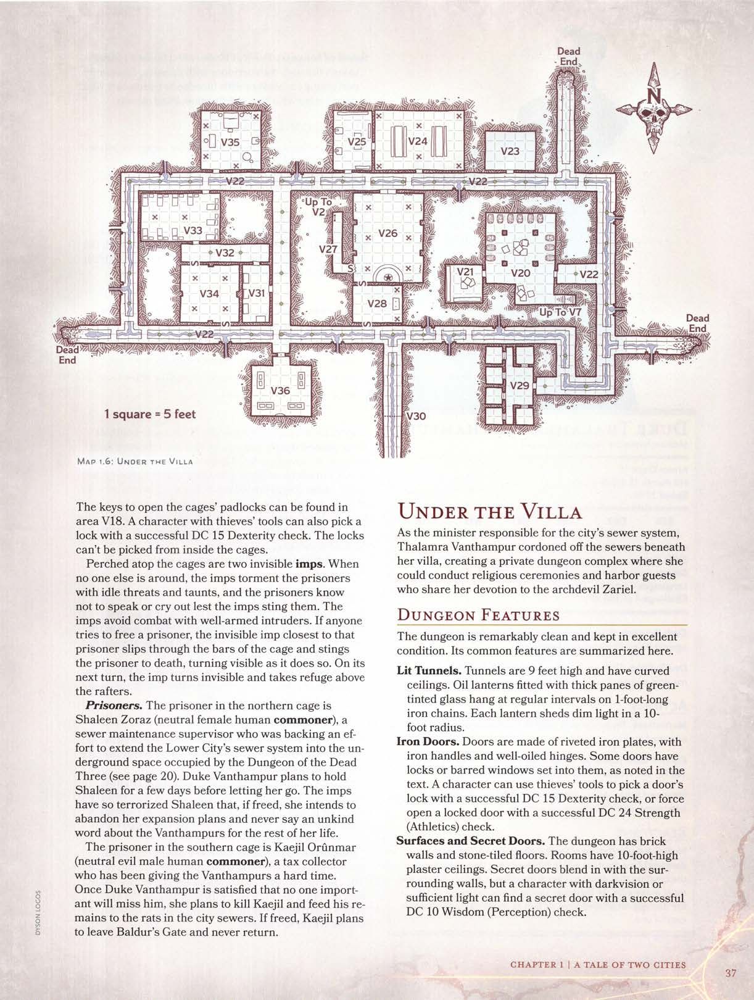

# Sob a Villa

Como ministra responsável pelo sistema de esgoto da cidade, **Thalamra Vanthampur** isolou os esgotos sob sua villa, criando um complexo de masmorra privado onde ela pudesse conduzir cerimônias religiosas e abrigar convidados que compartilham sua devoção à arquidiaba **Zariel**.

## Características da Masmorra
A masmorra é notavelmente limpa e mantida em excelentes condições. Suas características comuns são resumidas aqui.

**Túneis Iluminados.** Os túneis têm 2,7 metros (9 pés) de altura e possuem tetos curvos. Lanternas a óleo equipadas com painéis espessos de vidro tingido de verde pendem em intervalos regulares em correntes de ferro de 30 cm. Cada lanterna emite luz plena em um raio de 3 metros (10 pés).

**Portas de Ferro.** As portas são feitas de placas de ferro rebitadas, com maçanetas de ferro e dobradiças bem lubrificadas. Algumas portas têm fechaduras ou janelas com grades, conforme observado no texto. Um personagem pode usar ferramentas de ladrão para abrir a fechadura de uma porta com um sucesso em um **Teste de Destreza (CD 15)**, ou forçar a abertura de uma porta trancada com um sucesso em um **Teste de Força (Atletismo) (CD 24)**.

**Superfícies e Portas Secretas.** A masmorra tem paredes de tijolos e pisos de ladrilhos de pedra. As salas possuem tetos de gesso com 3 metros (10 pés) de altura. Portas secretas se misturam com as paredes circundantes, mas um personagem com visão no escuro ou luz suficiente pode encontrar uma porta secreta com um sucesso em um **Teste de Sabedoria (Percepção) (CD 10)**.

**Cheiro de Incenso.** Pares de cultistas humanos vestidos de preto marcham pelos corredores com incensários, perfumando constantemente os esgotos com incenso para neutralizar o que, de outra forma, seria um fedor levemente nauseante.

## Locais da Masmorra
Antes que os personagens desçam para a masmorra, permita que eles avancem para o **4º nível**.

As descrições das áreas a seguir são referentes ao **Mapa 1.6: Sob a Villa**.

### V19. Gaiolas de Prisioneiros
As chaves para abrir os cadeados das gaiolas podem ser encontradas na área **V18**. Um personagem com ferramentas de ladrão também pode abrir uma fechadura com um sucesso em um **Teste de Destreza (CD 15)**. As fechaduras não podem ser abertas por dentro das gaiolas.

Empoleirados no topo das gaiolas estão dois **imps** invisíveis. Quando ninguém mais está por perto, os imps atormentam os prisioneiros com ameaças vazias e provocações, e os prisioneiros sabem que não devem falar ou gritar, sob o risco de os imps os picarem. Os imps evitam combate com intrusos bem armados. Se alguém tentar libertar um prisioneiro, o imp invisível mais próximo desse prisioneiro escorrega pelas barras da gaiola e pica o prisioneiro até a morte, tornando-se visível ao fazê-lo. Em seu próximo turno, o imp torna-se invisível e busca refúgio acima das vigas.

**Prisioneiros.** A prisioneira na gaiola norte é **Shaleen Zoraz** (humana comum, neutra), uma supervisora de manutenção de esgotos que estava apoiando um esforço para estender o sistema de esgoto da Cidade Baixa para o espaço subterrâneo ocupado pela **Masmorra dos Três Mortos**. A **Duquesa Vanthampur** planeja manter Shaleen por alguns dias antes de soltá-la. Os imps aterrorizaram Shaleen de tal forma que, se libertada, ela pretende abandonar seus planos de expansão e nunca dizer uma palavra indelicada sobre os **Vanthampurs** pelo resto de sua vida.

O prisioneiro na gaiola sul é **Kaejil Orunmar** (humano comum, neutro e mau), um cobrador de impostos que tem dificultado a vida dos **Vanthampurs**. Assim que a **Duquesa Vanthampur** estiver convencida de que ninguém importante sentirá sua falta, ela planeja matar Kaejil e alimentar os ratos nos esgotos da cidade com seus restos. Se libertado, Kaejil planeja deixar o **Portão de Baldur** e nunca mais voltar.

### V20. Porão
Os personagens podem entrar neste porão descendo as escadas da área **V7**, ou podem entrar pela porta leste.

> Quatro pilares de pedra sustentam o teto abobadado de três metros de altura deste porão seco, cujas paredes estão alinhadas com uma dúzia de barris em suportes de madeira. Metade dos barris tem torneiras de latão encaixadas neles. A sala também contém duas pilhas de caixotes de madeira — uma no meio da sala e outra junto à parede sul.

O caixote superior no meio da sala contém três **diabos espinhosos** (*spined devils*) que espionam esta área através de buracos de nós nos lados do caixote. Esses diabos saltam e atacam intrusos à vista. Os outros caixotes no meio do porão contêm carne seca, pães, rodas de queijo e outros alimentos variados — o suficiente para sustentar os **Vanthampurs** e os cultistas na masmorra por um mês. Os caixotes na parede sul contêm velas, frascos de óleo, incenso e armadilhas para ratos.

Seis dos barris contêm água potável e seis contêm cerveja.

### V21. Adega de Vinhos
Mais de duzentas garrafas de vinho arrolhadas estão exibidas em prateleiras de madeira de 2,1 metros de altura que abrangem as paredes oeste e sul. Caixotes de madeira vazios estão empilhados no meio da sala.

**Tesouro.** Dezessete das garrafas contêm vinho fino (10 po por garrafa). Os vinhos restantes em exibição são safras comuns (1 pp por garrafa).

### V22. Túneis de Esgoto
Os habitantes da masmorra fazem uso frequente desses túneis iluminados. O cheiro espesso de incenso paira no ar.

Trincheiras de pedra lisa cortadas no chão canalizam água e dejetos para a área **V30**. Essas trincheiras têm 1,2 metro de largura e 90 cm de profundidade, com pontes de pedra em arco atravessandoas em intervalos irregulares. A borda de cada lado de uma trincheira tem 90 cm de largura.

**Monstros Errantes.** Ratos comuns ocasionalmente entram na masmorra através dos canos abertos nas paredes. Os cultistas colocam armadilhas para pegar e matar esses ratos enquanto perfumam a masmorra com incenso. À medida que os personagens avançam pelos túneis, eles podem encontrar esses cultistas.

Um encontro típico consiste em dois **cultistas** humanos leais e maus vestidos com mantos pretos, cada um carregando um incensário e usando uma máscara dourada fina moldada como o rosto de um diabo (e valendo 25 po para um comprador interessado). Os incensários contêm incenso queimando. Uma máscara de diabo cobre todo o rosto de quem a usa, exceto pelos olhos, narinas e boca. Não há duas máscaras exatamente iguais.

Se este encontro ocorrer em um túnel que tenha uma trincheira de esgoto correndo pelo meio, os dois cultistas estão caminhando em lados opostos da trincheira, movendo-se na mesma direção enquanto balançam seus incensários suavemente. Você pode tornar o encontro mais difícil substituindo os cultistas por **fanáticos do culto**, ou adicionando um ou mais **imps** invisíveis como escoltas.

Se quaisquer cultistas errantes forem derrotados, reduza o número de cultistas encontrados na área **V33** adequadamente. Se os personagens não fizerem esforço para esconder os corpos dos cultistas que derrotarem, alguém acabará tropeçando neles e avisará o **diabo farpado** na área **V26**. Supondo que ele ainda não tenha sido derrotado, o diabo vasculha a masmorra em busca de invasores assim que for notificado de sua presença.

### V23. Armazenamento Frio
Os **Vanthampurs** armazenam carcaças de animais e outras carnes frescas nesta sala. Penduradas no meio da sala, no teto de 3 metros de altura, estão seis correntes de 90 cm, cada uma terminando em um gancho. Carcaças de javali esfoladas pendem de quatro dos ganchos, enquanto os outros dois ganchos estão vazios.

### V24. Sala de Jantar
Os cultistas jantam aqui, embora nenhum esteja presente quando os personagens chegam pela primeira vez. Duas mesas de cavalete de madeira com bancos estão no meio da sala, que é brilhantemente iluminada por seis candelabros altos de ferro forjado dispostos ao longo das paredes. Cada candelabro tem 1,8 metro de altura e possui nove velas acesas no topo.

### V25. Cozinha
Os cultistas preparam suas refeições aqui, embora nenhum cultista esteja presente quando os personagens chegam pela primeira vez. A cozinha é desconfortavelmente quente e contém um par de fogões de ferro fundido queimando intensamente com pilhas de madeira ao lado deles. Outros móveis incluem uma mesa de cavalete de madeira onde a comida é preparada, bem como prateleiras forradas com pratos, canecas, panelas, utensílios e potes de ingredientes e especiarias.

### V26. Templo de Zariel
A porta dupla de ferro que leva a esta sala tem runas Infernais esculpidas em seu batente arqueado. Um personagem que entenda Infernal pode traduzir essas runas como: "Aquilo que cai pode se erguer novamente."

Um personagem que escute na porta dupla ou em uma das portas secretas que levam a esta sala ouve meia dúzia de vozes humanoides entoando cânticos em Infernal. Personagens que ouvem os cânticos e entendem esse idioma podem discernir louvores acumulados sobre a arquidiaba **Zariel** por seu esforço incansável para vencer a **Guerra de Sangue**.

Quando os personagens entram na sala, descreva a cena:

> Duas fileiras de candelabros altos de ferro forjado iluminam esta câmara abobadada, cada um com nove velas tremeluzentes. Uma estátua de dois metros de altura de um anjo com olhos brancos brilhantes e uma espada longa está no topo de um estrado ao sul. Um feitiço de seis pés de altura, eriçado de espinhos, está a oeste da estátua, olhando fixamente para quatro cultistas vestidos de preto que se ajoelham e entoam cânticos no meio da sala, seus rostos escondidos atrás de máscaras douradas de diabo. Nove tapeçarias retratando as camadas dos Nove Infernos adornam as paredes.

O ser espinhoso é um **diabo farpado** (*barbed devil*) chamado **Odious**. Enviado por **Zariel** para servir a **Duquesa Vanthampur**, o diabo responde apenas a essas duas. As figuras que entoam cânticos são quatro **cultistas** humanos leais e maus usando mantos pretos e máscaras douradas de diabo. O diabo e os cultistas atacam intrusos à vista, mas podem ser enganados por personagens usando disfarces.

**Estátua.** A estátua representa **Zariel** em sua forma angelical. É um objeto Grande com CA 17, 33 pontos de vida e imunidade a fogo, veneno e dano psíquico. Derrubar a estátua com um sucesso em um **Teste de Força (Atletismo) (CD 20)** faz com que ela se quebre no chão.

**Tesouro.** A cabeça e o pescoço da estátua são ocos. Alojada nesta cavidade está uma **maça +1** que pode ser removida apenas se a estátua for destruída. A cabeça da maça emite luz plena em um raio de 1,5 metro (5 pés) e luz penumbra por mais 1,5 metro. O portador da maça pode apagar ou acender sua luz como uma ação. (Esta luz é o que faz os olhos da estátua brilharem.)

---
> ### Personagens Disfarçados
> Os personagens podem se disfarçar usando máscaras e mantos retirados de cultistas derrotados. Enquanto estiverem disfarçados dessa forma, os personagens têm vantagem em **Testes de Carisma (Enganação)** feitos para enganar diabos e membros do culto na masmorra sob a Villa Vanthampur.
---

### V27. Túnel de Fuga
Escondido atrás de uma porta secreta, este túnel tem uma escada de madeira em sua extremidade norte. A escada sobe um poço de 4,5 metros de altura até um alçapão que se abre para a área **V2**.

### V28. Santuário Secreto
Esta sala está escondida atrás de portas secretas. O ruído de raspagem que qualquer uma das portas faz ao ser aberta é alto o suficiente para alertar o ocupante da sala.

> Esta sala é iluminada por um par de candelabros altos de ferro forjado nos cantos nordeste e sudeste. Nove velas queimam no topo de cada um, lançando luz tremeluzente sobre um altar com pés de garra esculpido em um único bloco de obsidiana, e que tem uma pequena chama em forma de anjo irrompendo de seu topo. Uma mulher de cabelos grisalhos se ajoelha diante do altar.

A **Duquesa Thalamra Vanthampur** se ajoelha diante do altar. Ela usa roupas finas adequadas para uma nobre de sua estatura e não carrega armas. No entanto, ela possui poderes mágicos concedidos por **Zariel**, sua patrona infernal. Qualquer intrusão é recebida com hostilidade, e a duquesa não tem escrúpulos em esmagar inimigos com as próprias mãos se se encontrar em combate corpo a corpo. Não se esqueça de sua reação *Repreensão Infernal*, que ela pode usar duas vezes por dia.

Se for reduzida a menos da metade de seus pontos de vida, **Thalamra** tenta escapar pela porta secreta mais próxima que não esteja bloqueada. Ela se move para a área **V36** ou tenta fugir pela área **V27**. Orgulhosa ao extremo, ela prefere morrer a se render ou ser feita prisioneira — e ela assistiria alegremente qualquer um de seus filhos morrer antes de consentir com exigências de resgate. Quando a morte finalmente a leva, as últimas palavras de **Thalamra** para seus assassinos são: "Vejo vocês no inferno."

**Thalamra** guarda duas chaves em um bolso de seu vestido. Uma chave abre o baú em seu quarto (área **V17**); a outra chave abre a porta do cofre (área **V36**).

**Altar de Obsidiana.** O altar preto pesa 360 kg (800 libras) e tem minúsculas runas Infernais esculpidas em um anel ao redor da chama de 23 cm em forma de anjo que irrompe de seu topo. Esta chama guarda apenas uma vaga semelhança com **Zariel**. Desfigurar qualquer uma das runas do altar extingue a chama e faz com que o altar se parta em dois.

---
#### Duquesa Thalamra Vanthampur
*Humanoide Médio (humano), leal e mau*
**Classe de Armadura** 10
**Pontos de Vida** 78 (12d8 + 24)
**Deslocamento** 9 m
**FOR** 17 (+3) **DES** 10 (+0) **CON** 15 (+2) **INT** 13 (+1) **SAB** 16 (+3) **CAR** 18 (+4)
**Perícias** Enganação +6, Intuição +5, Intimidação +6, Religião +3
**Sentidos** Percepção Passiva 13; Visão do Diabo (veja abaixo)
**Idiomas** Comum, Infernal
**Desafio** 4 (1.100 XP)

**Devoção Sombria.** Thalamra tem vantagem em testes de resistência contra ser enfeitiçada ou amedrontada.
**Visão do Diabo.** Thalamra pode ver normalmente na escuridão, tanto mágica quanto não mágica, a uma distância de até 36 metros (120 pés).

**Ações**
**Ataque Múltiplo.** Thalamra usa *Rajada Mística* duas vezes ou faz dois ataques desarmados.
**Rajada Mística (Truque).** *Ataque Mágico à Distância:* +6 para atingir, alcance 36 m, uma criatura. *Acerto:* 9 (1d10 + 4) de dano de força.
**Ataque Desarmado.** *Ataque Corpo a Corpo com Arma:* +5 para atingir, alcance 1,5 m, um alvo. *Acerto:* 4 de dano de concussão.

**Reações**
**Repreensão Infernal (Magia de 1º Nível; 2/Dia).** Quando Thalamra sofre dano de uma criatura em um raio de 18 metros que ela possa ver, a criatura que a causou dano é envolvida em chamas infernais e deve fazer um teste de resistência de **Destreza CD 14**, sofrendo 16 (3d10) de dano de fogo se falhar na resistência, ou metade desse dano se tiver sucesso.
---

### V29. Prisão

> Uma figura de ombros largos com pele roxa e uma barba de tentáculos sibilantes como cobras está no meio de uma sala ladeada por portas de ferro, apertando o cabo de uma glaive enquanto olha fixamente para você através da escuridão. Cada porta possui uma pequena janela com grades, e um molho de chaves pende do cinto da criatura.

O guarda da prisão é um **diabo barbado** (*bearded devil*) chamado **Thoss**, que ataca qualquer um que perceba como um intruso ou uma ameaça. Personagens disfarçados de cultistas podem tentar enganar **Thoss** para permitir que interroguem ou libertem prisioneiros. As chaves penduradas no cinto do diabo abrem as portas das celas.

Duas das celas contêm prisioneiros. As outras quatro celas estão vazias.

**Falaster Fisk.** O primeiro prisioneiro é um humano baixo, magro e erudito de cinquenta e poucos anos chamado **Falaster Fisk**. Originalmente de **Calimshan**, Falaster é um **espião** neutro sem armas. Ele fala Comum e Infernal e usa um caftã que vai até o tornozelo. Seu cavanhaque bem aparado é tingido de carmesim.

**Falaster** trabalha para **Sylvira Savikas**, uma especialista tiefling nos Nove Infernos baseada em **Candlekeep**. Quando **Thavius Kreeg** chegou ao **Portão de Baldur** há alguns dias, não demorou muito para Falaster ouvir rumores de que os **Vanthampurs** o estavam abrigando. Ele pode fornecer as seguintes informações:
* "**Sylvira Savikas** é uma sábia que opera em **Candlekeep**. Ela tem monitorado a atividade diabólica no **Portão de Baldur** e **Elturel** há meses."
* "Sylvira está convencida de que **Thavius Kreeg** fez um pacto com um arquidiabo, e que uma cópia do contrato que ele assinou está escondida dentro de uma caixa de quebra-cabeça mágica (puzzle box)."
* "Sylvira acha que pode abrir a caixa de quebra-cabeça de Kreeg e está disposta a pagar por ela — em ouro ou itens mágicos."

**Satiir Thione-Hhune.** A segunda prisioneira é uma mulher aristocrática de setenta e poucos anos chamada **Lady Satiir Thione-Hhune**. Nascida na rica e poderosa família patriar **Hhune**, Satiir é uma **nobre** neutra e má. Ela foi sequestrada pelos **Vanthampurs** para ser usada como moeda de troca caso os **Hhunes** descobrissem quem roubou o **Escudo do Senhor Escondido** da cripta de sua família.

Satiir é membro de uma ordem maligna secreta chamada **Cavaleiros do Escudo**, guardiões autodeclarados do **Escudo do Senhor Escondido**. Ela informa que os **Vanthampurs** planejavam usá-la para impedir que os **Hhunes** se opusessem à candidatura da **Duquesa Vanthampur** para se tornar a nova grã-duquesa.

---
> ### Personagens Aprisionados
> Se os personagens forem derrotados na Villa Vanthampur ou na masmorra abaixo, os vilões podem estabilizar os membros do grupo moribundos, despojá-los de seus equipamentos (que são armazenados na área **V28**) e trancá-los na prisão (área **V29**). Isso oferece à **Duquesa Thalamra Vanthampur** a oportunidade de interrogá-los.
---

### V30. Barreira de Barras de Ferro
Este túnel de esgoto desce gradualmente para o sul. O túnel é bloqueado por uma barreira de 3 metros quadrados composta de barras de ferro verticais com vãos de 15 cm — espaço suficiente para um rato passar, mas muito estreito para personagens. Um personagem pode dobrar as barras com um sucesso em um **Teste de Força (Atletismo) (CD 25)**.

### V31. Vestiário
Quatro guarda-roupas de madeira estão encostados nas paredes. Os cultistas guardam seus mantos e máscaras aqui antes de sair da masmorra. Personagens que revistarem o guarda-roupa na parede sul encontram quatro conjuntos de mantos pretos e quatro máscaras douradas de diabo.

### V32. Túnel de Conexão
Dois **fanáticos do culto** leais e maus guardam o túnel, um em cada extremidade. Eles usam mantos pretos e máscaras douradas. Sons de combate aqui alertam os cultistas na área **V33**.

### V33. Alojamentos dos Cultistas
Dez **cultistas** se reúnem aqui (menos quaisquer derrotados na área **V22**). Eles são humanos leais e maus. Eles compartilham rumores sobre a participação de **Thavius Kreeg** na queda de **Elturel** e os planos da **Duquesa Vanthampur** para o **Portão de Baldur**.

### V34. Câmara de Ritual
Esta sala está escondida atrás de portas secretas.

> Esta câmara abobadada de três metros de altura tem um teto de gesso pintado com imagens de diabos alados aterrorizantes olhando para um símbolo incrustado no chão: um disco circular de pedra negra com uma estrela dourada de nove pontas. Quatro candelabros de ferro forjado com velas vermelhas meio derretidas cercam o círculo.

Os cultistas usam esta câmara para realizar rituais diabólicos que duplicam o efeito de uma magia de *Adivinhação*, exceto que o contato é um diabo que se manifesta como uma coluna de fumaça.

### V35. Alojamentos de Thavius Kreeg

> Candelabros de ferro forjado iluminam esta sala, que é aquecida por um fogão de ferro fundido. Há uma mesa modesta com uma cadeira, uma cama e um baú de ferro aos pés da cama. Duas tapeçarias adornam as paredes: uma mostrando espíritos surgindo como diabos lemures do Rio Estige, e outra retratando um homem morto pendurado como uma marionete em correntes com ganchos.

**Tesouro.** Thavius guarda um símbolo sagrado de **Torm** (um pingente de prata em forma de manopla direita) no baú. Vale 25 po.

### V36. Cofre Vanthampur
A porta está trancada e a **Duquesa Vanthampur** tem a única chave.

> Esta sala contém quatro mesas de madeira com dois pequenos cofres em cima de cada uma. Pendurado na parede oposta à porta está um belo escudo dourado. Parado em frente ao escudo está um homem idoso em trajes simples, carregando uma vela acesa. Quando ele se vira, você vê que sua sombra na parede distante não corresponde à sua forma, mas parece ser a sombra de um diabo rechonchudo com chifres e pequenas asas.

O homem é **Thavius Kreeg**, o antigo **Grão-Vigário** de **Elturel**. Antigamente um clérigo de **Torm**, ele perdeu sua habilidade de conjurar magias quando abandonou sua fé. O escudo na parede atrás dele é o **Escudo do Senhor Escondido**. Thavius tem conversado com **Gargauth**, o ser aprisionado no escudo, e concluiu que o escudo é responsável por muito da ganância e malícia no **Portão de Baldur**. Ele acredita que pode usar o escudo para arrastar o **Portão de Baldur** para **Avernus**.

Thavius mente sobre sua relação com a **Duquesa Vanthampur**, alegando ter sido capturado. No entanto, sua sombra revela sua verdadeira natureza corrupta.

## Navegação
- [Voltar para a Vila Vanthampur](07-vila-vanthampur.md)
- [Ir para Concluindo a Missão](09-concluindo-a-missao.md)
- [README.md](../../README.md)
