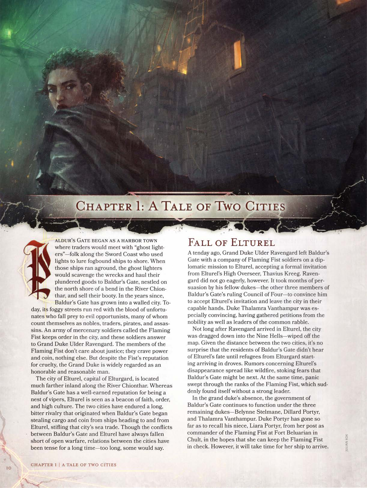

# Capítulo 1: Um Conto de Duas Cidades

**Baldur's Gate** começou como uma cidade portuária onde comerciantes se encontravam com "sinalizadores fantasmagóricos" — pessoas ao longo da **Costa da Espada** que usavam luzes para atrair navios perdidos no nevoeiro para a costa. Quando esses navios encalhavam, os sinalizadores saqueavam os destroços e levavam as mercadorias pilhadas para **Baldur's Gate**, situada na margem norte de uma curva no **Rio Chionthar**, para vender seu butim.

Nos anos seguintes, **Baldur's Gate** cresceu e se tornou uma cidade murada. Hoje, suas ruas nebulosas correm vermelhas com o sangue de desafortunados que caem vítimas de oportunistas malignos, muitos dos quais se consideram nobres, mercadores, piratas e assassinos. Um exército de soldados mercenários chamado **Punho Flamejante** mantém a ordem na cidade, e esses soldados respondem ao **Grão-Duque Ulder Ravengard**. Os membros do **Punho Flamejante** não se importam com a justiça; eles anseiam por poder e moedas, nada mais. Mas, apesar da reputação de crueldade do Punho, o Grão-Duque é amplamente considerado um homem honrado e razoável.

A cidade de **Elturel**, capital de **Elturgard**, localiza-se muito mais para o interior, ao longo do **Rio Chionthar**. Enquanto **Baldur's Gate** tem uma reputação bem merecida de ser um ninho de víboras, **Elturel** é vista como um farol de fé, ordem e alta cultura. As duas cidades suportam uma rivalidade longa e amarga que se originou quando **Baldur's Gate** começou a roubar cargas e moedas de navios que iam e vinham de **Elturel**, sufocando o comércio marítimo daquela cidade. Embora os conflitos entre as duas cidades nunca tenham chegado a uma guerra aberta, as relações têm sido tensas por muito tempo — tempo demais, diriam alguns.

## Subcapítulos

1. [A Queda de Elturel](01-queda-de-elturel.md)
2. [O Mal em Baldur's Gate](02-mal-em-baldurs-gate.md)
3. [O Portão do Basilisco](03-o-portao-do-basilisco.md)
4. [Taverna Elfsong](04-taverna-elfsong.md)
5. [Calabouço dos Três Mortos](05-calabouco-dos-tres-mortos.md)
6. [Low Lantern](06-low-lantern.md)
7. [Villa Vanthampur](07-villa-vanthampur.md)
8. [Abaixo da Villa](08-sob-a-villa.md)
9. [Encontros Finais em Baldur's Gate](09-encontros-finais.md)
10. [Jornada para Candlekeep](10-jornada-candlekeep.md)
11. [Candlekeep](11-candlekeep.md)
12. [Chegando em Avernus](12-chegada-avernus.md)

---

## Narrando Este Capítulo

O **Fluxograma 1.1** apresenta os eventos principais deste capítulo em sequência. Os aventureiros começam como personagens de **1º nível**, avançando conforme superam os desafios:

- **1º Nível**: Começam no **Portão do Basilisco** e vão para a **Taverna Canção de Elfos**.
- **2º Nível**: Alcançado após sobreviverem à taverna e invadirem a **Masmorra dos Três Mortos**.
- **3º Nível**: Alcançado após a masmorra. Seguem para a **Lanterna Baixa** e **Vila Vanthampur**.
- **4º Nível**: Alcançado após a Vila. Seguem para o **Forte da Vela**.
- **5º Nível**: Alcançado antes de entrarem em **Avernus**.

---

## Navegação
- [Voltar para o Início](../../README.md)
